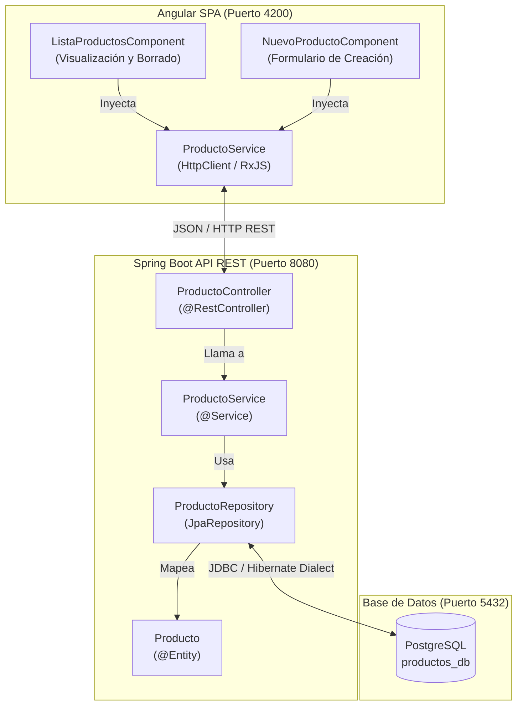

# Informe Técnico Detallado: Versiones, Arquitectura y Estructura del Proyecto

> [!NOTE]
> Este informe presenta el análisis integral del proyecto **Guía CRUD Angular + Spring Boot**, detallando las versiones exactas de las tecnologías implementadas, la arquitectura de capas y el árbol estructural completo del workspace.

---

## 1. Resumen Ejecutivo y Stack Tecnológico

El proyecto es una solución **Fullstack (API REST + Single Page Application)** para la gestión de productos (CRUD). Está construido bajo una arquitectura moderna utilizando las últimas versiones principales y preliminares de **Angular** en el frontend y **Spring Boot** en el backend, conectado a una base de datos relacional **PostgreSQL**.

### Tabla de Versiones del Stack Core

| Componente | Tecnología / Librería | Versión | Rol / Descripción |
| :--- | :--- | :--- | :--- |
| **Backend Framework** | Spring Boot | `4.1.0` | Framework principal de API REST (a través de `spring-boot-starter-parent`) |
| **Lenguaje Backend** | Java | `25` | Versión de Java configurada en `pom.xml` (`<java.version>25</java.version>`) |
| **Gestor de Dependencias** | Apache Maven | Wrapper (`mvnw`) | Automatización de compilación y empaquetado |
| **ORM / Persistencia** | Spring Data JPA / Hibernate | `4.1.0` (Inferred) | Mapeo objeto-relacional y acceso a base de datos |
| **Driver DB** | PostgreSQL JDBC Driver | Runtime de Spring Boot | Conectividad JDBC con PostgreSQL (`org.postgresql`) |
| **Herramientas Java** | Lombok | `optional / test` | Generación automática de getters, setters, constructores y builders |
| **Frontend Framework** | Angular (Core & Common) | `^22.0.0` | Framework SPA moderno con componentes standalone |
| **Frontend CLI & Build** | `@angular/cli` / `@angular/build` | `^22.0.1` | Herramientas de compilación y servidor de desarrollo |
| **Lenguaje Frontend** | TypeScript | `~6.0.2` | Superconjunto tipado para JavaScript |
| **Programación Reactiva**| RxJS | `~7.8.0` | Manejo de flujos asíncronos y peticiones HTTP |
| **Testing Frontend** | Vitest / jsdom | `^4.0.8` / `^28.0.0` | Entorno de pruebas unitarias ultrarrápido para Angular |
| **Gestor de Paquetes** | npm | `11.13.0` | Gestor de dependencias de Node.js (`packageManager`) |

---

## 2. Diagrama de Arquitectura y Flujo de Datos



---

## 3. Estructura Detallada del Workspace

El proyecto está organizado en dos directorios principales raíz (`Angular` y `Spring`), junto con documentación y guías en la raíz del espacio de trabajo.

```
d:\Guias_Practicas\HTML\Guia_CRUD_Angular\
├── guia-angular-rest.md              # Documentación y guía teórica/práctica
├── plan.md                           # Plan de desarrollo y notas
│
├── Angular/                          # [FRONTEND] Aplicación SPA Angular 22
│   ├── angular.json                  # Configuración de espacios de trabajo, build y assets de Angular CLI
│   ├── package.json                  # Definición de dependencias npm y scripts de ejecución
│   ├── proxy.conf.json               # Configuración del proxy para redirigir peticiones al API de Spring Boot
│   ├── tsconfig.json                 # Configuración principal de TypeScript (v6.0.2)
│   └── src/
│       ├── index.html                # Documento HTML principal (Single Page)
│       ├── main.ts                   # Punto de entrada de bootstrapping de Angular
│       ├── styles.css                # Estilos globales de la interfaz
│       └── app/
│           ├── app.config.ts         # Configuración global standalone (proveedores de router, HttpClient, etc.)
│           ├── app.routes.ts         # Definición de rutas de la aplicación
│           ├── app.ts                # Componente raíz (`AppComponent`)
│           ├── models/
│           │   └── producto.model.ts # Interfaz TypeScript `Producto` (id, nombre, precio, stock...)
│           ├── services/
│           │   └── producto.service.ts # Servicio inyectable `ProductoService` para llamadas REST HTTP
│           └── components/
│               ├── lista-productos/  # Componente para listar y administrar el catálogo
│               │   ├── lista-productos.component.html
│               │   ├── lista-productos.component.ts
│               │   └── lista-productos.component.css
│               └── nuevo-producto/   # Componente para registro de nuevos ítems
│                   ├── nuevo-producto.component.html
│                   ├── nuevo-producto.component.ts
│                   └── nuevo-producto.component.css
│
└── Spring/                           # [BACKEND] Proyecto API REST Spring Boot 4.1.0
    ├── pom.xml                       # Archivo de dependencias y build de Maven (Java 25, PostgreSQL, JPA)
    ├── mvnw / mvnw.cmd               # Wrappers ejecutables de Maven para Linux/Windows
    └── src/
        └── main/
            ├── resources/
            │   └── application.properties # Parámetros de conexión a PostgreSQL y puerto de servidor
            └── java/
                └── com/edu/Guia/
                    ├── GuiaApplication.java            # Clase principal de arranque de Spring Boot (`@SpringBootApplication`)
                    ├── model/
                    │   └── Producto.java               # Entidad de persistencia JPA (`@Entity`)
                    ├── repository/
                    │   └── ProductoRepository.java     # Interfaz de acceso a datos (`JpaRepository`)
                    ├── service/
                    │   └── ProductoService.java        # Lógica de negocio transaccional (`@Service`)
                    └── controller/
                        └── ProductoController.java     # Endpoints REST (`@RestController`, `@CrossOrigin`)
```

---

## 4. Análisis Detallado por Componente

### 4.1 Backend (Spring Boot & Java)
* **Archivo de Configuración de Base de Datos**: En [application.properties](file:///d:/Guias_Practicas/HTML/Guia_CRUD_Angular/Spring/src/main/resources/application.properties), el servidor está configurado para escuchar en el puerto `8080`. Se conecta a la base de datos `productos_db` mediante `jdbc:postgresql://localhost:5432/productos_db` utilizando el dialecto `PostgreSQLDialect`.
* **Entidad `Producto`**: Ubicada en [Producto.java](file:///d:/Guias_Practicas/HTML/Guia_CRUD_Angular/Spring/src/main/java/com/edu/Guia/model/Producto.java), representa la tabla de base de datos e incluye anotaciones de persistencia de Spring Data JPA (y opcionalmente Lombok).
* **Repositorio (`ProductoRepository`)**: Definido en [ProductoRepository.java](file:///d:/Guias_Practicas/HTML/Guia_CRUD_Angular/Spring/src/main/java/com/edu/Guia/repository/ProductoRepository.java), hereda de `JpaRepository<Producto, Long>`, heredando operaciones automáticas como `findAll()`, `findById()`, `save()` y `deleteById()`.
* **Servicio (`ProductoService`)**: Ubicado en [ProductoService.java](file:///d:/Guias_Practicas/HTML/Guia_CRUD_Angular/Spring/src/main/java/com/edu/Guia/service/ProductoService.java), encapsula la lógica comercial y las transacciones antes de llegar al controlador.
* **Controlador REST (`ProductoController`)**: En [ProductoController.java](file:///d:/Guias_Practicas/HTML/Guia_CRUD_Angular/Spring/src/main/java/com/edu/Guia/controller/ProductoController.java), expone las rutas RESTful (`GET /api/productos`, `POST /api/productos`, `DELETE /api/productos/{id}`, etc.) procesadas por Angular.

### 4.2 Frontend (Angular Standalone)
* **Modelo de Datos**: En [producto.model.ts](file:///d:/Guias_Practicas/HTML/Guia_CRUD_Angular/Angular/src/app/models/producto.model.ts), se define la estructura tipada que coincide exactamente con los campos devueltos por la API del backend.
* **Servicio HTTP**: El archivo [producto.service.ts](file:///d:/Guias_Practicas/HTML/Guia_CRUD_Angular/Angular/src/app/services/producto.service.ts) utiliza `HttpClient` y `Observable` (RxJS v7.8) para comunicarse asíncronamente con el backend REST, apoyándose en la configuración de proxy ([proxy.conf.json](file:///d:/Guias_Practicas/HTML/Guia_CRUD_Angular/Angular/proxy.conf.json)) para evitar problemas de CORS durante el desarrollo en local.
* **Componente `lista-productos`**: Controlado por [lista-productos.component.ts](file:///d:/Guias_Practicas/HTML/Guia_CRUD_Angular/Angular/src/app/components/lista-productos/lista-productos.component.ts), se encarga de obtener la lista de productos al iniciar el ciclo de vida (`ngOnInit`) y gestiona las acciones de visualización y eliminación de registros.
* **Componente `nuevo-producto`**: Controlado por [nuevo-producto.component.ts](file:///d:/Guias_Practicas/HTML/Guia_CRUD_Angular/Angular/src/app/components/nuevo-producto/nuevo-producto.component.ts), gestiona la captura de datos del formulario reactivo o basado en plantillas para enviar solicitudes de creación (POST) al servidor.

---

## 5. Comandos de Operación y Compilación

### Backend (Directorio `Spring`)
```powershell
# Levantar el servidor en puerto 8080 en modo desarrollo
.\mvnw.cmd spring-boot:run

# Compilar y generar el artefacto .jar (sin ejecutar tests)
.\mvnw.cmd clean package -DskipTests
```

### Frontend (Directorio `Angular`)
```powershell
# Instalar dependencias exactas de Node/Angular
npm install

# Iniciar servidor de desarrollo en http://localhost:4200 (con proxy al backend)
npm start
# o directamente:
ng serve --proxy-config proxy.conf.json

# Ejecutar tests unitarios con Vitest
npm test

# Construir para producción (dist)
npm run build
```
